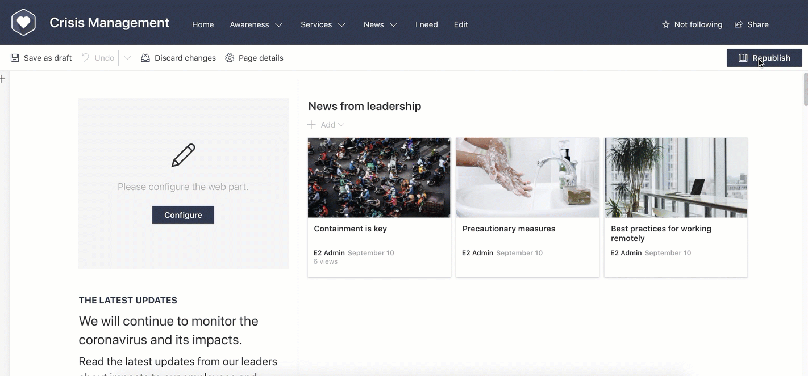

## target-audience-generic-component

Sample webpart which uses a Generic React Component which enables it to have Target Audience functionality like what was available in classic webparts.
Targets SharePoint Groups only within the site.




### Building the code

```bash
git clone the repo
npm i
npm i -g gulp
gulp
```

This package produces the following:

* lib/* - intermediate-stage commonjs build artifacts
* dist/* - the bundled script, along with other resources
* deploy/* - all resources which should be uploaded to a CDN.

### Build options

gulp clean - TODO
gulp test - TODO
gulp serve - TODO
gulp bundle - TODO
gulp package-solution - TODO
